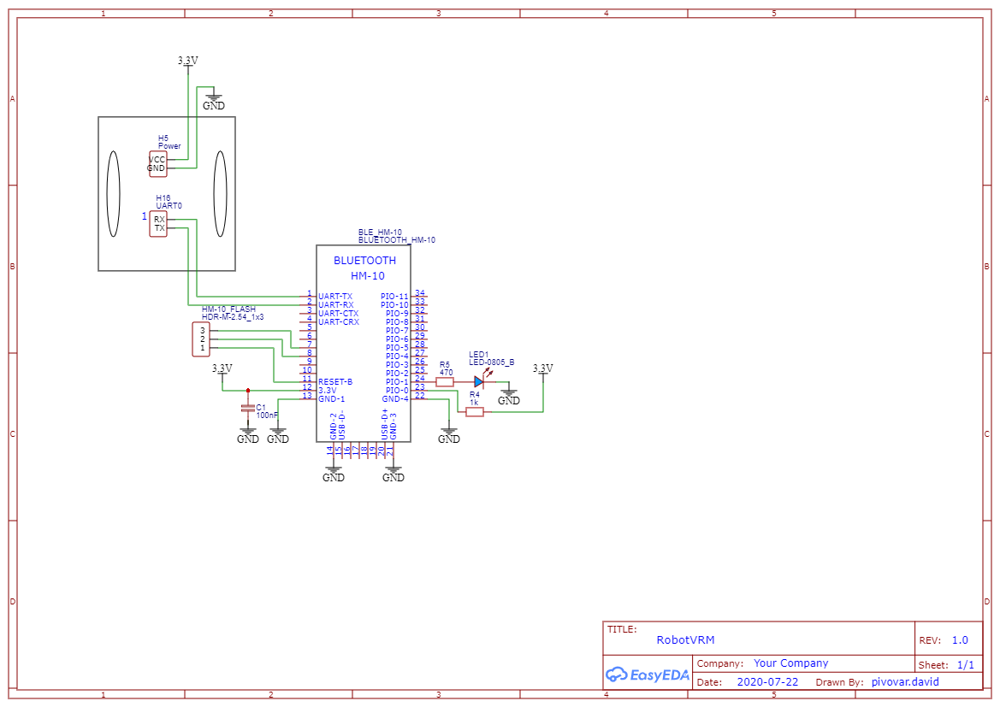
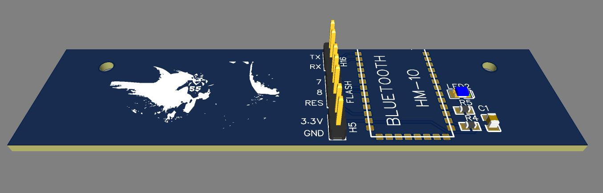

# RobotVoiceControl

Control Robot vehicle (RobotTMR - ZCU) with mobile app.
Communication with robot is via HM-10 BLE module (HMSoft firmware required - [how to flash the firmware](https://circuitdigest.com/node/3688))

### RobotVoiceControlMobileApp
Mobile app for Android and iOS with speech recognition (iOS speech recognition is not tested). Build with Xamarin.Forms.\
Speech recognition requires an Azure Cognitive Services resource ([Create a Cognitive Services resource](https://docs.microsoft.com/cs-cz/azure/cognitive-services/cognitive-services-apis-create-account?tabs=multiservice%2Cwindows)). Set API key and region in [Constants.cs](RobotVoiceControlMobileApp/RobotVoiceControlMobileApp/Constants.cs).

### RobotVRM
Firmware for supervisor MSP430 MCU. Updated original firmware with BLE communication on UART0.

##### Pins to connect HM-10:
* VCC/GND - H5 (VCC next to 22uF capacitor)
* TX/RX - H16 (UART0_RX at "1")

#### Schematic

#### PCB

